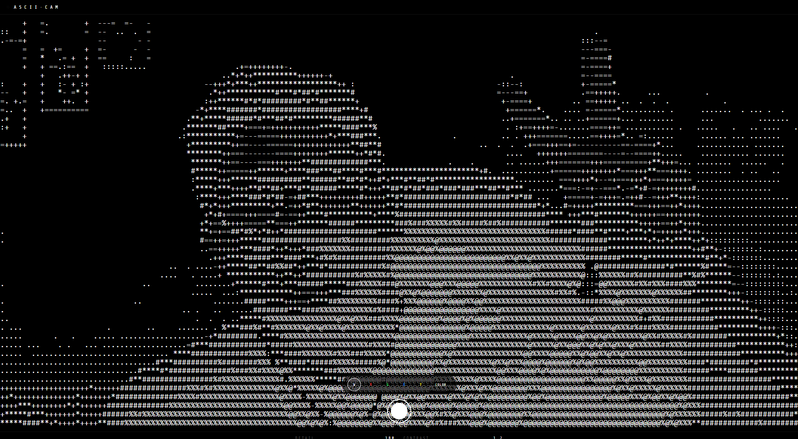

# ASCII VISION

🔗 Live Demo: https://ascii-vision-tau.vercel.app/

  

Real-time webcam to ASCII rendering experience built with React, Vite, Canvas API, and Web Audio API.
Real-time webcam to ASCII rendering experience built with React, Vite, Canvas API, and Web Audio API.

Features:

* Live ASCII camera feed
* RGB & monochrome filters
* Detail + contrast controls
* Camera shutter export
* Mobile responsive UI
* Interactive sound effects

Built as a creative vibe-coded experiment focused on realtime rendering, cyber aesthetics, and browser APIs.

Tech:
React • Vite • JavaScript • HTML5 Canvas • Web Audio API
